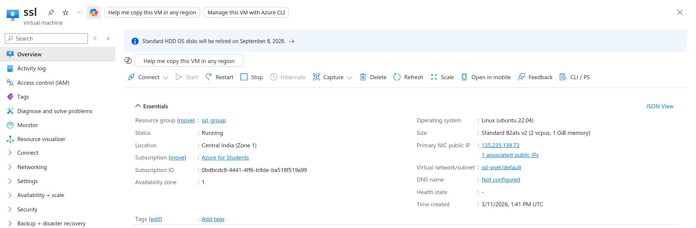

## Task 1:initial setup
### Create an ubuntu VM in azure
start by making a VM in Azure using the nitc student pack offer.

## System Updates and Security
update ubuntu
```bash
sudo apt update
sudo apt upgrade -y
```
do unattended upgrade and enable services
```bash
sudo apt install unattended-upgrades -y
sudo dpkg-reconfigure -plow unattended-upgrades
```

