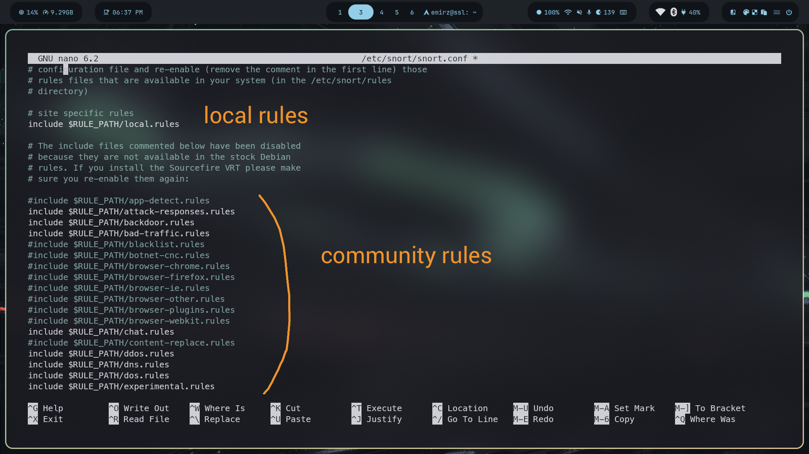

## Firewall

### configure ufw
```bash
sudo apt install ufw
```
allowing https, http and 
```bash
sudo ufw allow 2222/tcp
sudo ufw allow 80 /tcp #http
sudo ufw allow 443/tcp #https

sudo ufw status

sudo ufw defualt deny incoming
sudo default allow outgoing
sudo ufw enable
sudo ufw status verbose
```

enabling ufw logs

```bash
sudo ufw loggin on
sudo ufw status verbose
```

NOTES:
 ip tables has chains. Prerouting → INPUT → FORWARD →OUTPUT → POSTROUTING . Tables determine what operations needs to be performed on data packets.

    filter:(default table) determines if packets needs to be let in your computer.

    Nat: Network Address Transition): responsible for creating new connection. It can change ip address.

    Mangle: Changing something inside specialized packets before coming or leaving out

    Raw: trackig connection state

Targets is what to do if rule matches.

    ACCEPT: accept with response

    REJECT: discard with response

    DROP: silently discard

        LOG: log packet

Targets are of two types: terminating and non terminating.


### snort setup
```bash
sudo apt-get update
sudo apt install snort -y

#ip address needs to be fetched from iptable a. for mine, its from eth0
```
It asks for ip address of local network, I gave it as 10.0.0.0/24 instead of 10.0.0.4/24 . The reason i changed it to 0 from 4 is that original one is the host ip address while changed version represents entire subnet which can be used by snort for rule matching. 


## snort config




comment out community rules for testing

To get logs as csv and pcap file i added this line under configure output plugins

```code
output alert_csv: /var/log/snort/alert.csv default
output log_tcpdump: /var/log/snort/tcpdump.log
```

to test it 
```bash
sudo snort -T -i ens33 -c /etc/snort/snort.conf
```
Notes:
snort rule structure:

[action] [protocol] [sourceIP] [sourcePort] → [DestinationIP] [DestinationPort] ([Rule options])

All Snort Rule Options are seperated from each other using semicolon(;). Rule option keywords are separated from their arguments with a colon(:)


### local config

```bash
#detect incoming ICMP packets
alert icmp any any -> $HOME_NET any (msg:”ICMP Detection Rule”; sid:100001;)

#detect incoming ssh connection attempt
alert tcp any any -> $HOME_NET 2222 (msg: “SSH Connection Attempts”; sid:100002; )

#detect command execution system
alert tcp any any -> $HOME_NET 80 (msg:”Command Execution Attempt”; content:”GET”; content:”/etc/passwd”; sid:100003; )
```

I need to allow icmp port and https port in aazure portal. This can be done by adding inbound rule under the networking settings.

Validate the local rules created.
```bash
sudo snort -T -i eth0 -c /etc/snort/snort.conf
```

```bash
sudo snort -q -l /var/log/snort -i eth0 -A console -c /etc/snort/snort.conf

#icmp detection
alert icmp any any -> $HOME_NET any (msg:”ICMP Detection Rule”; sid:100001;)
#then from local laptop 
ping ping 135.235.139.73

#command execution detection
alert tcp any any -> $HOME_NET 80 (msg:”Command Execution Attempt”; content:”GET”; content:”/etc/passwd”; sid:100003; )
#then from local laptop
curl http://135.235.139.73/etc/passwd


```

I need to allow icmp port and https port in aazure portal. This can be done by adding inbound rule under the networking settings.

Validate the local rules created.

```bash
sudo snort -T -i eth0 -c /etc/snort/snort.conf
```

Now to test it

```bash
sudo snort -q -l /var/log/snort -i eth0 -A console -c /etc/snort/snort.conf

#icmp detection
alert icmp any any -> $HOME_NET any (msg:”ICMP Detection Rule”; sid:100001;)
#then from local laptop 
ping ping 135.235.139.73

#command execution detection
alert tcp any any -> $HOME_NET 80 (msg:”Command Execution Attempt”; content:”GET”; content:”/etc/passwd”; sid:100003; )
#then from local laptop
curl http://135.235.139.73/etc/passwd
```

